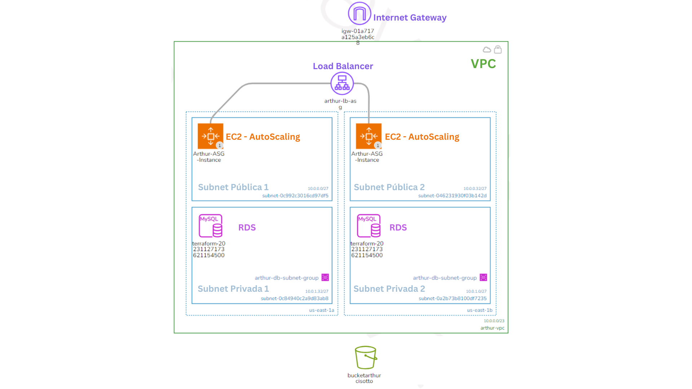

# ProjetoCloud23_2

## Aluno: Arthur Cisotto Machado

### Introdução
Esta documentação explora a construção de uma infraestrutura AWS robusta e escalável, ideal para aplicações web que demandam alta disponibilidade e performance. Utilizando o Terraform, uma ferramenta de orquestração de infraestrutura como código, a documentação detalha a implementação de serviços chave como Elastic Load Balancer (ELB), Auto Scaling Groups (ASG), e Amazon Relational Database Service (RDS). A arquitetura foi projetada para  suportar o tráfego variável e garantir a resiliência da aplicação.

### Configuração do Provider (provider.tf) 
**AWS Provider**: A integração com a AWS através do Terraform é realizada especificando o AWS Provider, uma configuração essencial para acessar e gerenciar a ampla gama de recursos da AWS. A região `us-east-1` é escolhida por sua rica oferta de serviços e infraestrutura confiável, além de oferecer melhores preços em comparação com outras regiões. 

**Backend S3**: O uso de um bucket S3 como backend para o Terraform é um método eficaz para armazenar e gerenciar o estado da infraestrutura. Além de facilitar o controle de versão, ele oferece segurança adicional e permite que equipes colaborem sem conflitos de estado, assegurando uma gestão de infraestrutura mais coesa e eficiente.

#### provider.tf

``` terraform
provider "aws" {
  profile = "default"
  region  = "us-east-1"
}

terraform {
  backend "s3" {
    bucket = "bucketarthurcisotto"
    key    = "terraform.tfstate"
    region = "us-east-1"
  }
}
```

### Load Balancer (load_balancer.tf) 
**Application Load Balancer (ALB)**: O ALB é central para gerenciar e distribuir o tráfego de entrada entre as instâncias EC2. Ele é ideal para aplicações baseadas em HTTP/HTTPS, proporcionando funcionalidades avançadas como o roteamento baseado em conteúdo, o que permite uma distribuição mais inteligente do tráfego.

**Target Group**: O target group é configurado com um health check, assegurando que apenas instâncias saudáveis sejam elegíveis para receber tráfego. Isso não só melhora a confiabilidade e a disponibilidade da aplicação, mas também permite uma resposta mais rápida a quaisquer problemas que possam surgir nas instâncias.

**Listener**: O listener no ALB é configurado para assegurar que requisições na porta 80 (HTTP) sejam redirecionadas para o target group apropriado. Esta configuração é vital para uma gestão eficiente e segura do tráfego de entrada.

#### load_balancer.tf

``` terraform

# Application Load Balancer
resource "aws_lb" "arthur_alb" {
  name               = "arthur-lb-asg"
  internal           = false
  load_balancer_type = "application"
  security_groups    = [aws_security_group.arthur_sg_for_alb.id]
  subnets            = [aws_subnet.arthur_public_subnet1.id, aws_subnet.arthur_public_subnet2.id]
}

resource "aws_lb_target_group" "arthur_alb_tg" {
  name     = "arthur-alb-tg"
  port     = 80
  protocol = "HTTP"
  vpc_id   = aws_vpc.arthur_main_vpc.id

  # Configuração de Health Checks
  health_check {
    enabled             = true
    interval            = 30
    path                = "/healthcheck"  
    protocol            = "HTTP"
    healthy_threshold   = 3
    unhealthy_threshold = 3
    timeout             = 5
    matcher             = "200"
  }
}

resource "aws_lb_listener" "arthur_alb_listener" {
  load_balancer_arn = aws_lb.arthur_alb.arn
  port              = "80"
  protocol          = "HTTP"

  default_action {
    type             = "forward"
    target_group_arn = aws_lb_target_group.arthur_alb_tg.arn
  }
}
```

### Auto Scaling (autoscaling.tf)
**Launch Template**: O template de lançamento define os parâmetros das instâncias EC2, como a imagem da máquina Amazon (AMI) e o tipo de instância. O script de inicialização incluído no template configura automaticamente as instâncias com todas as dependências necessárias, e inicia a aplicação, promovendo uma padronização e uma inicialização eficiente das novas instâncias.

**Auto Scaling Group (ASG)**: O ASG é crucial para a escalabilidade da aplicação, ajustando automaticamente o número de instâncias EC2 em resposta à demanda. Isso garante que a aplicação mantenha uma performance estável e responsiva sob diferentes cargas de trabalho. O ASG também é configurado para distribuir as instâncias em diferentes zonas de disponibilidade, garantindo a resiliência da aplicação em caso de falhas.

**CloudWatch Alarms**: Os alarmes do CloudWatch são configurados para monitorar métricas críticas como a utilização da CPU. Esses alarmes permitem que o ASG ajuste dinamicamente o número de instâncias, mantendo a aplicação otimizada para a demanda atual.

#### autoscaling.tf

``` terraform
# Auto Scaling Group com Launch Template
resource "aws_launch_template" "arthur_ec2_launch_template" {
  name_prefix   = "arthur-ec2-launch"
  image_id      = "ami-0fc5d935ebf8bc3bc"
  instance_type = "t2.micro"


    user_data = base64encode(<<-EOF
    #!/bin/bash
    export DEBIAN_FRONTEND=noninteractive
    
    sudo apt-get update
    sudo apt-get install -y python3-pip python3-venv git

    # Criação do ambiente virtual e ativação
    python3 -m venv /home/ubuntu/myappenv
    source /home/ubuntu/myappenv/bin/activate

    # Clonagem do repositório da aplicação
    git clone https://github.com/ArthurCisotto/aplicacao_projeto_cloud.git /home/ubuntu/myapp

    # Instalação das dependências da aplicação
    pip install -r /home/ubuntu/myapp/requirements.txt

    sudo apt-get install -y uvicorn
 
    # Configuração da variável de ambiente para o banco de dados
    export DATABASE_URL="mysql+pymysql://dbadmin:secretpassword@${aws_db_instance.arthur_rds.endpoint}/arthur_db"

    cd /home/ubuntu/myapp
    # Inicialização da aplicação
    uvicorn main:app --host 0.0.0.0 --port 80 
  EOF
  )

  network_interfaces {
    associate_public_ip_address = true
    subnet_id                   = aws_subnet.arthur_public_subnet1.id
    security_groups             = [aws_security_group.arthur_sg_for_ec2.id]
  }
  tag_specifications {
    resource_type = "instance"
    tags = {
      Name = "Arthur-instance"
    }
  }
}

resource "aws_autoscaling_group" "arthur_asg" {
  desired_capacity     = 2
  max_size             = 6
  min_size             = 2
  vpc_zone_identifier  = [aws_subnet.arthur_public_subnet1.id, aws_subnet.arthur_public_subnet2.id]
  target_group_arns    = [aws_lb_target_group.arthur_alb_tg.arn]

  launch_template {
    id      = aws_launch_template.arthur_ec2_launch_template.id
    version = "$Latest"
  }

  # Políticas de Escalabilidade
  health_check_type          = "ELB"
  health_check_grace_period  = 300
  force_delete               = true

  tag {
    key                 = "Name"
    value               = "Arthur-ASG-Instance"
    propagate_at_launch = true
  }
}

# CloudWatch Alarm para Escalabilidade
resource "aws_cloudwatch_metric_alarm" "arthur_high_cpu" {
  alarm_name          = "HighCPUUtilization"
  comparison_operator = "GreaterThanThreshold"
  evaluation_periods  = "2"
  metric_name         = "CPUUtilization"
  namespace           = "AWS/EC2"
  period              = "120"
  statistic           = "Average"
  threshold           = "70"
  alarm_description   = "This alarm monitors EC2 CPU utilization"

  dimensions = {
    AutoScalingGroupName = aws_autoscaling_group.arthur_asg.name
  }

  alarm_actions = [aws_autoscaling_policy.arthur_scale_up.arn]
  ok_actions    = [aws_autoscaling_policy.arthur_scale_down.arn]
}

resource "aws_cloudwatch_metric_alarm" "arthur_low_cpu" {
  alarm_name          = "LowCPUUtilization"
  comparison_operator = "LessThanThreshold"
  evaluation_periods  = "2"
  metric_name         = "CPUUtilization"
  namespace           = "AWS/EC2"
  period              = "120"
  statistic           = "Average"
  threshold           = "10"
  alarm_description   = "This alarm monitors EC2 CPU utilization"

  dimensions = {
    AutoScalingGroupName = aws_autoscaling_group.arthur_asg.name
  }

  alarm_actions = [aws_autoscaling_policy.arthur_scale_down.arn]
  ok_actions    = [aws_autoscaling_policy.arthur_scale_up.arn]
}

# Política de Escalabilidade para Aumentar a Escala
resource "aws_autoscaling_policy" "arthur_scale_up" {
  name                   = "scale_up"
  scaling_adjustment     = 1
  adjustment_type        = "ChangeInCapacity"
  cooldown               = 300
  autoscaling_group_name = aws_autoscaling_group.arthur_asg.name
}

# Política de Escalabilidade para Reduzir a Escala
resource "aws_autoscaling_policy" "arthur_scale_down" {
  name                   = "scale_down"
  scaling_adjustment     = -1
  adjustment_type        = "ChangeInCapacity"
  cooldown               = 300
  autoscaling_group_name = aws_autoscaling_group.arthur_asg.name
}
```

### Database (database.tf) 
**RDS Instance**: A instância RDS é configurada para usar MySQL, com foco em alta disponibilidade e segurança dos dados. Recursos como backups automáticos e a opção Multi-AZ são configurados para garantir a continuidade dos negócios e a recuperação rápida em caso de falhas. A instância RDS é configurada nas subnets privadas, garantindo que ela não seja acessível pela Internet.

#### database.tf

``` terraform
resource "aws_db_subnet_group" "arthur_db_subnet_group" {
  name       = "arthur-db-subnet-group"
  subnet_ids = [aws_subnet.arthur_private_subnet1.id, aws_subnet.arthur_private_subnet2.id]
  tags = {
    Name = "Arthur DB Subnet Group"
  }
}

# Exemplo de configuração de um banco de dados RDS MySQL
resource "aws_db_instance" "arthur_rds" {
  db_name             = "arthur_db"
  allocated_storage    = 20
  storage_type         = "gp2"
  engine               = "mysql"
  engine_version       = "5.7"
  instance_class       = "db.t2.micro"
  username             = "dbadmin"
  password             = "secretpassword"
  parameter_group_name = "default.mysql5.7"
  skip_final_snapshot  = true
  publicly_accessible  = false
  vpc_security_group_ids = [aws_security_group.arthur_db_sg.id]
  db_subnet_group_name = aws_db_subnet_group.arthur_db_subnet_group.name

  # Habilitar backups automáticos e definir janela de manutenção
  backup_retention_period = 7 # dias
  backup_window = "03:00-04:00"
  maintenance_window = "Sun:04:30-Sun:05:30"


  # Habilitar Multi-AZ
  multi_az = true
}
```


### Rede (network.tf e routes.tf) 
**VPC e Subnets**:

 A configuração da Virtual Private Cloud (VPC) e das subnets é a base da rede. A VPC proporciona isolamento dos recursos da AWS, enquanto as subnets públicas e privadas são utilizadas para organizar recursos com base na necessidade de acesso externo.
 
 As subnets públicas são configuradas para permitir o acesso à Internet, enquanto as subnets privadas são configuradas para permitir o acesso apenas à VPC. Essa configuração é essencial para garantir a segurança e o isolamento da rede interna.

**Internet Gateway e Route Tables**: O Internet Gateway habilita a comunicação entre a VPC e a Internet. As tabelas de rotas são configuradas para garantir o correto encaminhamento do tráfego na VPC, um componente crítico para uma rede AWS funcional.

#### network.tf

``` terraform
# VPC
resource "aws_vpc" "arthur_main_vpc" {
  cidr_block = "10.0.0.0/23"
  tags = {
    Name = "arthur-vpc"
  }
}

# Subnets Públicas
resource "aws_subnet" "arthur_public_subnet1" {
  vpc_id                  = aws_vpc.arthur_main_vpc.id
  cidr_block              = "10.0.0.0/27"
  map_public_ip_on_launch = true
  availability_zone       = "us-east-1a"
}

resource "aws_subnet" "arthur_public_subnet2" {
  vpc_id                  = aws_vpc.arthur_main_vpc.id
  cidr_block              = "10.0.0.32/27"
  map_public_ip_on_launch = true
  availability_zone       = "us-east-1b"
}

# Subnet Privada
resource "aws_subnet" "arthur_private_subnet1" {
  vpc_id                  = aws_vpc.arthur_main_vpc.id
  cidr_block              = "10.0.1.0/27"
  map_public_ip_on_launch = false
  availability_zone       = "us-east-1b"
}

resource "aws_subnet" "arthur_private_subnet2" {
  vpc_id                  = aws_vpc.arthur_main_vpc.id
  cidr_block              = "10.0.1.32/27"
  map_public_ip_on_launch = false
  availability_zone       = "us-east-1a"
}

# Internet Gateway
resource "aws_internet_gateway" "arthur_igw" {
  vpc_id = aws_vpc.arthur_main_vpc.id
}

```


#### routes.tf
    
``` terraform
# Tabelas de Rotas
resource "aws_route_table" "arthur_public_rt" {
  vpc_id = aws_vpc.arthur_main_vpc.id
  route {
    cidr_block = "0.0.0.0/0"
    gateway_id = aws_internet_gateway.arthur_igw.id
  }
}

resource "aws_route_table_association" "arthur_rta_public1" {
  subnet_id      = aws_subnet.arthur_public_subnet1.id
  route_table_id = aws_route_table.arthur_public_rt.id
}

resource "aws_route_table_association" "arthur_rta_public2" {
  subnet_id      = aws_subnet.arthur_public_subnet2.id
  route_table_id = aws_route_table.arthur_public_rt.id
}    
```


### Security Groups (security_groups.tf) 
**EC2, ALB e RDS Security Groups**: A configuração dos grupos de segurança é feita com precisão para regular o acesso a recursos como EC2, ALB e RDS. Essas configurações são vitais para a proteção da infraestrutura contra acessos não autorizados e potenciais ameaças.

O Security Group para as instâncias EC2 é configurado para permitir o tráfego HTTP e SSH, enquanto o Security Group para o ALB é configurado para permitir o tráfego HTTP e HTTPS. O Security Group para o RDS é configurado para permitir o tráfego MySQL apenas para as instâncias EC2, garantindo que apenas as instâncias possam acessar o banco de dados.

#### security_groups.tf

``` terraform

# Security Groups para as instâncias EC2 (regras de entrada e saída)
resource "aws_security_group" "arthur_sg_for_ec2" {
  name        = "arthur-sg-for-ec2"
  description = "Security Group for EC2 Instances"
  vpc_id      = aws_vpc.arthur_main_vpc.id

  # Regras de entrada (permitir tráfego HTTP)
  ingress {
    from_port   = 80
    to_port     = 80
    protocol    = "tcp"
    cidr_blocks = ["0.0.0.0/0"]
  }

  ingress {
    from_port   = 22
    to_port     = 22
    protocol    = "tcp"
    cidr_blocks = ["0.0.0.0/0"]
  }

  # Regras de saída (liberar todo o tráfego)
  egress {
    from_port   = 0
    to_port     = 0
    protocol    = "-1"
    cidr_blocks = ["0.0.0.0/0"]
  }
}

# Security Group para o Load Balancer (regras de entrada e saída)
resource "aws_security_group" "arthur_sg_for_alb" {
  name        = "arthur-sg-for-alb"
  description = "Security Group for Application Load Balancer"
  vpc_id      = aws_vpc.arthur_main_vpc.id

  # Regras de entrada (permitir tráfego HTTP e HTTPS)
  ingress {
    from_port   = 80
    to_port     = 80
    protocol    = "tcp"
    cidr_blocks = ["0.0.0.0/0"]
  }

  ingress {
    from_port   = 443
    to_port     = 443
    protocol    = "tcp"
    cidr_blocks = ["0.0.0.0/0"]
  }

  # Regras de saída (liberar todo o tráfego)
  egress {
    from_port   = 0
    to_port     = 0
    protocol    = "-1"
    cidr_blocks = ["0.0.0.0/0"]
  }
}

# Security Group para o RDS (regras de entrada e saída)
resource "aws_security_group" "arthur_db_sg" {
  name        = "arthur-db-sg"
  description = "Security Group for RDS"
  depends_on = [aws_vpc.arthur_main_vpc]
  vpc_id      = aws_vpc.arthur_main_vpc.id

  # Regras de entrada (permitir tráfego MySQL)
  ingress {
    from_port   = 3306
    to_port     = 3306
    protocol    = "tcp"
    security_groups = [aws_security_group.arthur_sg_for_ec2.id] # Permitir que as instâncias EC2 se conectem ao RDS
  }

  # Regras de saída (liberar todo o tráfego)
  egress {
    from_port   = 0
    to_port     = 0
    protocol    = "-1"
    cidr_blocks = ["0.0.0.0/0"]
  }
}
```

### Outputs (outputs.tf) 
**Output de Documentação**: Este output fornece um link para a documentação detalhada da aplicação, facilitando o acesso a informações importantes para o usuário.

#### outputs.tf

``` terraform
output "link_to_docs" {
  value = "http://${aws_lb.arthur_alb.dns_name}/docs"
}
```

### Guia Passo a Passo 
1. **Pré-requisitos**: Verifique se o Terraform e a AWS CLI estão instalados.
2. **Criação das Chaves de Acesso AWS**: Acesse o IAM na AWS, crie um novo usuário com acesso programático e anote as chaves de acesso.
3. **Configuração da AWS CLI**: Use o comando `aws configure` para inserir suas credenciais e configurações regionais.
4. **Criação do Bucket S3**: Crie um bucket S3 para armazenar o estado do Terraform e atualize o nome do bucket no arquivo `provider.tf`, no bloco `backend "s3"` no campo `bucket`.
5. **Inicialização do Terraform**: Prepare seu ambiente com `terraform init`.
6. **Aplicação do Terraform**: Implemente a infraestrutura com `terraform apply -auto-approve`.
7. **Validação**: Após a aplicação, use o link de output (link_to_docs) para acessar a documentação da aplicação e verificar se ela está funcionando corretamente.
8. **Destruição da Infraestrutura**: Destrua a infraestrutura com `terraform destroy -auto-approve`.

### [Link para o vídeo de demonstração do projeto](https://youtu.be/TSk15kIm-78)

###Diagrama da Infraestrutura
